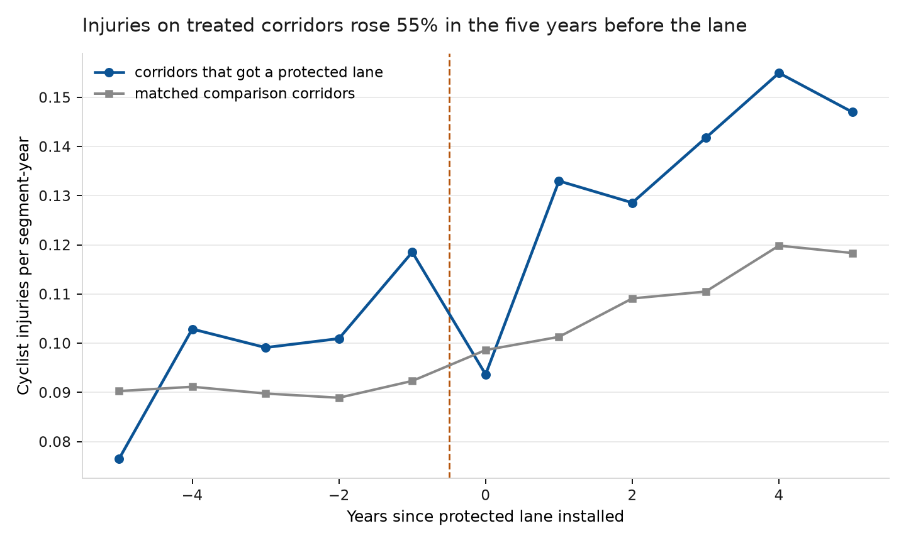
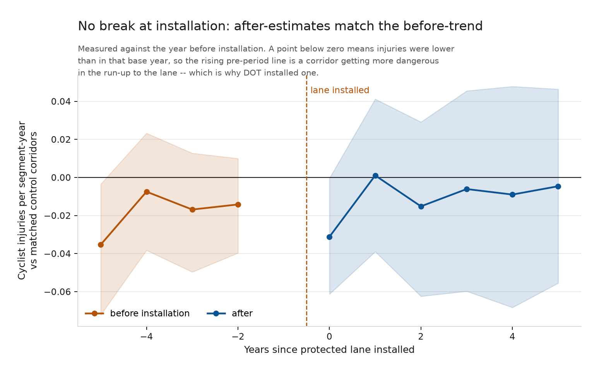
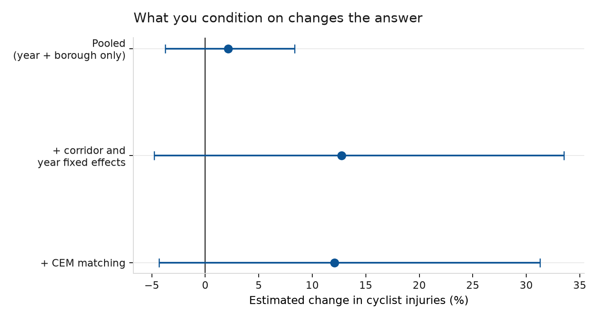
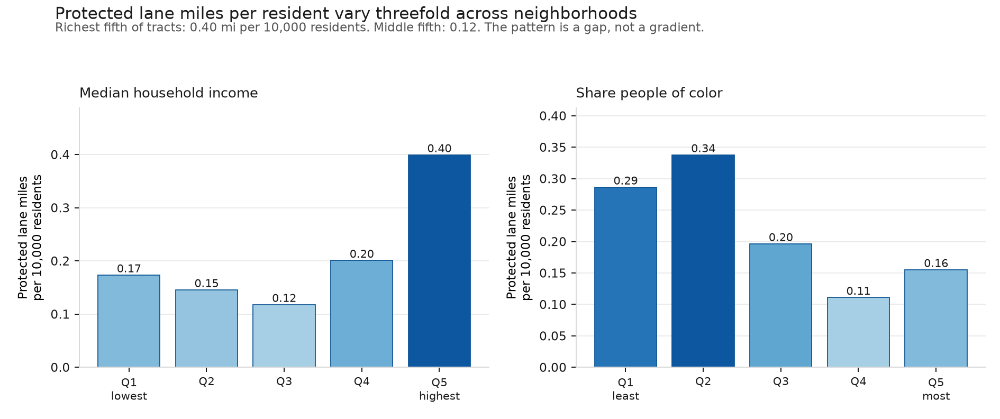
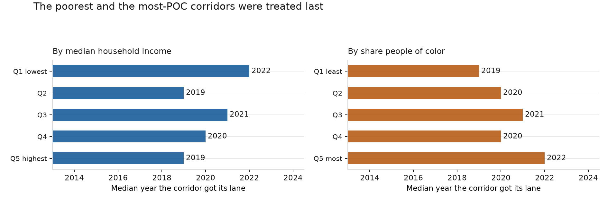

# Did New York's protected bike lanes make cycling safer?

### What twelve years of city data can and cannot tell us

**Kazmir Fahrier** · August 2026
Analysis of 57,353 cyclist-injury crashes, 4,357 protected lane segments, and 6.2 million ridership counter readings, 2013–2024. All data public. Code and full reproduction at `github.com/KazmirFahrier/nyc-bike-lane-safety`.

*Independent analysis by a private individual, written on my own initiative using public
data. Not affiliated with, commissioned by, endorsed by, or speaking for the New York City
Department of Transportation, the Vision Zero program, or any government agency or
organization.*

---

## The short version

Between 2013 and 2024 the Department of Transportation installed protected bike lanes on 4,357 street segments — 519 distinct corridors. This analysis asked whether cyclist injuries fell on those corridors relative to comparable corridors that did not get lanes.

**The answer is that the question cannot be settled with this data, and the reason is worth knowing.**

DOT does not install protected lanes at random. It installs them where cyclists are already being hurt. Corridors that received a protected lane saw their cyclist-injury rate **rise 55% over the five years before installation**, while matched comparison corridors stayed flat. By the year the lane went in, treated corridors were running injury rates a third higher than the corridors they most resemble.

That is good government. It is also fatal to the standard evaluation method. When a program is targeted at a problem that has just spiked, the problem tends to subside afterward whether or not the program works — and the standard method cannot tell the two apart.

The consequence is concrete. Three defensible analytic choices give three different answers, and they do not agree on the direction:

| Approach | Estimated change in cyclist injuries |
|---|---|
| Compare to the year before installation | **−17.7%** (range −57% to +20%) |
| Compare to the earlier pre-installation years | **+8.0%** (range −17% to +35%) |
| Compare within each corridor, before vs after | **+12.1%** (range −4% to +31%) |

None of these is statistically distinguishable from no change. More importantly, the difference between the first row and the other two is not a finding about bike lanes. It is a finding about which year you choose as the point of comparison — and treated corridors' injuries peak in exactly the year the first row uses.

**None of this is evidence that protected lanes are ineffective or harmful.** The honest statement is narrower and more useful: *the observational record of NYC's protected lane program does not support a credible estimate of its safety effect, and any published figure that does not address the targeting problem should be treated with suspicion — including figures that flatter the program.*

**One question the data *can* settle is who got the lanes.** Distribution is observed, not
inferred, so it needs no counterfactual. The answer is a clear disparity: the richest fifth
of census tracts has **3.4 times** the protected lane mileage per resident of the middle
fifth, and the corridors in the poorest and the most-people-of-color neighborhoods were
treated a median of **three years later** than those in the richest and whitest.

What the data support is set out below, along with what it would take to answer the safety
question properly.

---

## Why this is hard

The intuitive comparison — injuries on lanes versus injuries elsewhere — is wrong in a way that is easy to state. Protected lanes go on busy, dangerous corridors. Those corridors would have more cyclist injuries than quiet residential streets whether or not they had lanes. Comparing them directly measures where the lanes are, not what they do.

This analysis addresses it the standard way: every treated corridor is compared only against corridors **in the same borough, with a similar recent injury history**, in the same years. This is coarsened exact matching, and it works — before matching, Manhattan's treated corridors were running 4.04 pre-period injuries against 2.95 on untreated corridors; after matching, 4.04 against 3.93.

Matching also revealed something that a citywide average conceals. **Selection runs in opposite directions in different boroughs.** In Manhattan, DOT put lanes on corridors more dangerous than average. In the Bronx, it put them on corridors *safer* than average (1.17 versus 1.72 pre-period injuries). A single citywide comparison nets these against each other and appears unbiased while being wrong in both boroughs.

But matching on the *level* of past injuries does not fix matching on the *trend*. That is the problem that remains, and it is the one that matters.

Read the chart from the left. Five years before installation, corridors that would later receive a protected lane were **safer** than their eventual comparison group — 0.076 cyclist injuries per segment-year against 0.090. Over the next four years they deteriorated sharply, peaking at 0.119 the year before the lane arrived. The comparison corridors barely moved across the same period.

This is the signature of a well-targeted program, and it is also the signature of a question that observational data cannot answer. The corridors were selected *because* they were getting worse.

---

## What the analysis found

### The estimate depends on an arbitrary choice

The standard method compares outcomes after treatment to the year immediately before it. Applied here, that means comparing against the worst year those corridors had — the spike that triggered the intervention.

Using a different but equally defensible reference period — the four years before that spike — the estimated effect reverses sign, from −17.7% to +8.0%.

An effect estimate that flips direction depending on which pre-treatment year you anchor to is not an effect estimate. It is a measurement of the spike.

The chart above makes the same point differently. If protected lanes changed cyclist safety, a visible break at installation would be expected — estimates sitting at one level before and a different level after. They do not. The post-installation estimates occupy the same range as the pre-installation ones. Whatever was happening on these corridors before the lane continued afterward.

### Conditioning choices move the answer more than the treatment does

Comparing corridors with and without lanes, adjusting only for year and borough, gives +2.1%. Adding corridor fixed effects — comparing each corridor to itself, before and after — moves it to +12.7%. Adding matching leaves it at +12.1%.

The movement between these is the size of the selection problem. It is larger than any plausible effect of the lanes.

### One methodological point worth flagging for anyone evaluating staggered programs

The most common statistical method for this kind of rollout, two-way fixed effects, gives **+21.2%** here — a substantially different number from the estimator designed for staggered adoption (−17.7% on the same base period). When a program is rolled out over many years and its effects vary over time, two-way fixed effects uses already-treated units as comparisons for later-treated ones, and can return the wrong sign even when every underlying effect points the same way.

Agencies evaluating phased rollouts — and that is most of them — should be aware that this method, which remains the default in a great deal of published work, is not reliable in this setting.

---

## What the data *do* establish

Three findings are solid, do not depend on the contested causal question, and are directly actionable.

**1. Cycling in New York grew 44.5% between 2014 and 2024,** measured from DOT's own automated counters on a like-for-like basis. Growth was not steady: the largest single-year jump was **+22.2% in 2020**. Any assessment of cyclist safety that reports injury counts without this denominator is misleading. Injuries can rise while risk per rider falls.

**2. Crash geocoding quality varies enough to affect analysis.** 7.5% of cyclist-injury crash records cannot be placed on a map — some have no coordinates, 217 records place the crash at latitude 0, in the Gulf of Guinea. The rate is not stable over time: 86.3% of 2016 records geocoded successfully against 94.8% in 2023. Any year-over-year corridor comparison inherits that swing.

**3. The bike route file needs three corrections before it can be used for evaluation.** These are not criticisms of a file that was built for a different purpose, but they are traps:

- **"Protected" covers two different things.** 5,220 records are on-street protected lanes; 3,215 are greenway and park paths carrying the identical label. They are different interventions with different rider populations and no adjacent motor traffic. Treating them as one credits street redesign with greenway safety.
- **403 "protected" segments carry installation dates before 1990** — 1894, 1900, 1909 — inherited from the underlying street centerline rather than from any bike facility.
- **439 protected segments are retired with no recorded end date.** A corridor that gained a lane and later lost it is not treated for the whole period, and the file does not say when it stopped.

**4. Two bridge counters are double-counted.** "Manhattan Bridge Display Bike Counter" and "Manhattan Bridge Bike Comprehensive" report identical daily totals on 2,338 days from the same coordinates; the Brooklyn Bridge has the same duplication. Summing all counters overstates the two busiest cycling crossings in the city.

---

## Who got the lanes

The safety question needs a counterfactual the data cannot supply. The distribution
question does not — who received a lane is observed. It is also the question a health
department asks, and it has a clear answer.

Corridors are matched to census tracts by length-weighted overlay: a corridor crossing
three tracts counts toward each in proportion to the length inside it. Assigning each
corridor to one tract by its midpoint would misattribute exactly the long avenues that
tend to receive protected lanes. Demographics are 2018–2022 American Community Survey
5-year estimates across all 2,327 NYC tracts.

**Measured per resident, provision varies more than threefold.** The richest fifth of
tracts has 0.40 protected lane miles per 10,000 residents; the middle fifth has 0.12.
Nearly half of tracts in the richest fifth (47.7%) contain some protected lane, against
15.2% in the middle fifth.

**The pattern is a gap, not a gradient, and that matters for how it is read.** The poorest
fifth is *not* the worst served — it has 0.17 miles per 10,000, above the middle fifth.
Much of that reflects dense, low-income tracts close to Manhattan, which sit inside the
core network for reasons of geography rather than of equity. The clean statement is that
the top quintile is far better served than everyone else, not that provision declines
steadily as income falls. The same holds by race: the fourth quintile of
people-of-color share is the worst served (0.11), not the fifth (0.16).

**Conditioning on the existing network narrows the gap but does not close it.** Among
corridors that already carried some bike facility, 34.3% of those in the richest tracts
were upgraded to protected, against 19.3% in the second-poorest. By race, 33.7% of
corridors in the second-least-POC quintile were upgraded against 20.4% in the fourth.
That comparison holds constant the fact that DOT had already identified the street as a
cycling route — so the disparity is not only about where the network reaches, but about
which parts of it were upgraded.

**The timing gap is the cleanest result in this analysis.** Corridors in the poorest fifth
of tracts got their protected lanes in 2022 at the median; those in the richest fifth, in
2019. By share of people of color the gap is identical — 2022 against 2019. Three years,
on a program whose stated purpose is preventing deaths.

Two cautions. This is an *ecological* comparison: tract characteristics describe the
neighborhood a corridor runs through, not the people who ride it, and cyclists on a
corridor may live elsewhere. And per-resident provision counts residents near a lane, not
riders — a corridor serving a commuting route may be well used by people no tract-level
count captures. Neither caution reaches the timing result, which compares corridors to
corridors and does not depend on a denominator.

---

## What would actually answer the question

The obstacle is not data volume. It is that installation timing is driven by the outcome being measured. Four routes past it, in rough order of cost:

**Use DOT's own project pipeline records.** Corridors that were *proposed* for a protected lane but not built — because of community board opposition, a competing capital project, or budget timing — are the comparison group this analysis needs. They were selected by the same process, at the same point in their injury history, and did not receive treatment. This is the single highest-value addition, and the records exist inside DOT.

**Exploit installation delays.** Where a corridor's construction was postponed for reasons unrelated to its safety record, the delay creates precisely the variation needed. Same corridors, same selection, different timing.

**Measure ridership where the lanes are.** The city has 41 automated counters. They cannot measure ridership on 4,357 treated segments, so this study models corridor-level exposure rather than measuring it — the weakest link in the design and the reason the per-rider question stays open. Counters on a sample of treated and matched untreated corridors, installed *before* construction, would close it.

**Record intended installation dates prospectively.** Much of the reconstruction difficulty here — undated removals, centerline dates standing in for facility dates — would disappear if the treatment date and the removal date were recorded as a matter of course.

---

## How this was done

**Data.** NYPD Motor Vehicle Collisions (`h9gi-nx95`), 57,353 crashes involving a cyclist injury or fatality, 2013–2024. DOT Bike Routes (`mzxg-pwib`), 29,695 segment records. DOT automated bicycle counters (`uczf-rk3c`), 6.2 million 15-minute readings across 41 sites. American Community Survey 2018–2022 5-year estimates for all 2,327 NYC census tracts, with TIGER tract geometry — taken from the Census Bureau's public summary files, which need no API key or account. All public, all free.

**Unit of analysis.** Corridors, not blocks: maximal contiguous runs of same-street, same-borough segments sharing one treatment history. DOT installs lanes on corridors rather than blocks, and 92.5% of individual segment-years contain zero cyclist injuries, which is too sparse to model. Aggregation gives 2,234 corridors and reduces zero-outcome observations to 68.4%.

**Assigning crashes to corridors.** NYPD geocodes crashes onto the street centerline, and street segments meet end-to-end at intersections, so 92% of crashes sit within one foot of two or more centerlines. Ties are broken on the street NYPD independently reports; where the tied segments still disagree about treatment status — 3,911 crashes, 13.4% — the crash is flagged and excluded from the main analysis rather than assigned arbitrarily.

**Estimation.** Callaway–Sant'Anna group-time average treatment effects for the staggered rollout, with corridor-level block bootstrap inference (1,000 replications). Poisson pseudo-maximum-likelihood with corridor and year fixed effects and corridor-clustered standard errors for the within-corridor estimates; Poisson rather than negative binomial because it stays consistent under the overdispersion present here (variance-to-mean ratio 6.5) without the incidental-parameters problem that affects negative binomial with thousands of fixed effects.

**Verification.** The group-time estimator was implemented twice — once in Python, once written independently in R from the estimator's definition — and the two agree to within one part in a quadrillion across all 99 group-time cells. The corridor construction was likewise built twice, in DuckDB and in PostGIS, producing an identical partition of all 20,439 segments. The data pipeline carries 39 automated tests, including an end-to-end check that no cyclist injury is created or lost between the raw crash records and the analysis panel.

**Reproduction.** Every data pull records the source's own row count, the exact filter, and the count landed; a pull that does not reconcile fails rather than writing a short file. `make all` reproduces the analysis from a clean checkout.

---

## Limitations

This analysis cannot say whether protected lanes are effective. It establishes that the observational record does not support a credible answer, and why.

It also cannot speak to: whether lanes caused ridership to rise (which would mean the per-rider safety gain is understated here); unreported crashes, since NYPD records only what is reported; near-misses, comfort, or whether people feel safe enough to ride; or the effect of any particular corridor's lane, since all estimates are averages.

On equity, the distribution question is answered above; the second half of it is not.
Whether any safety *gains* were shared evenly cannot be established, for the same reason
the citywide safety effect cannot: there is no credible estimate of the effect to
distribute. The disparity documented here is in who received the treatment and when, which
stands on its own.

---

*Independent analysis of public data by a private individual. Not affiliated with,
endorsed by, or produced for any government agency or organization. Findings and any
errors are my own.*
