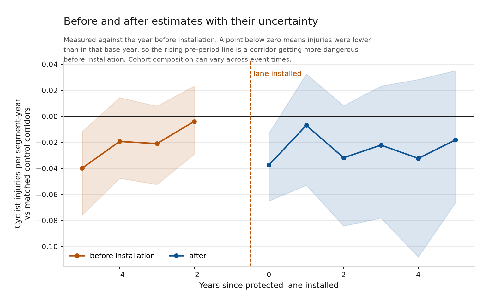
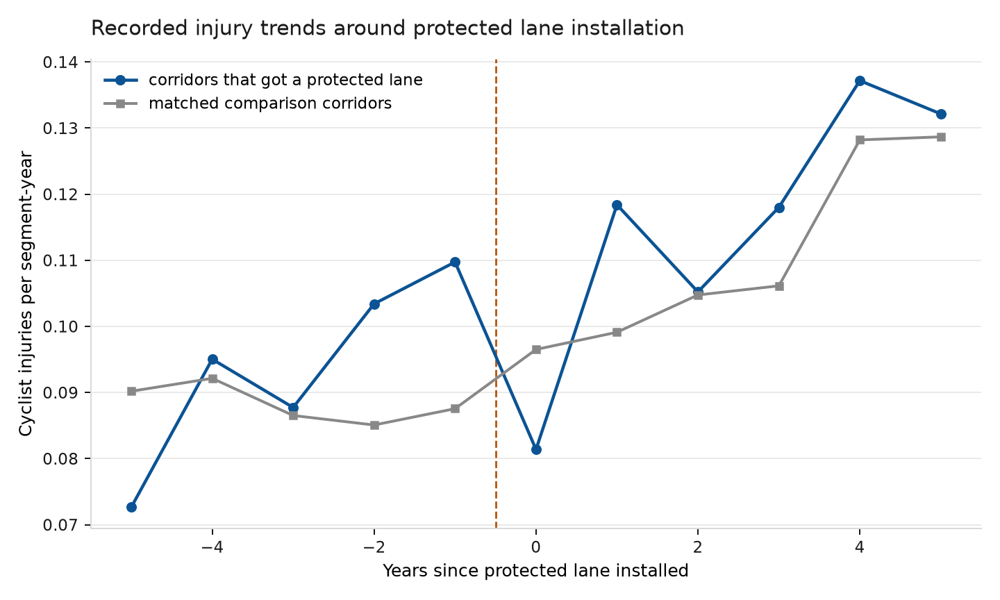
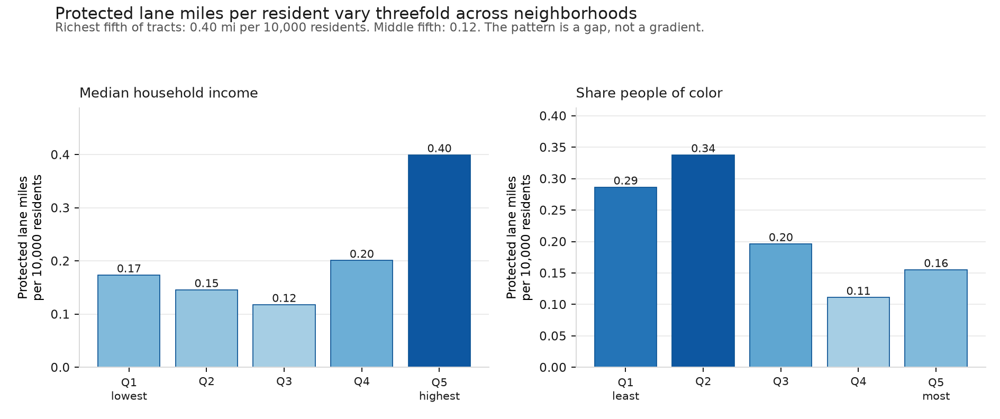
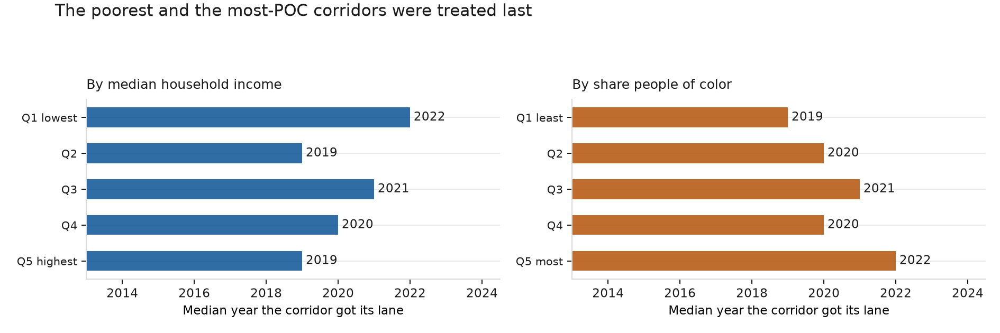

# Protected bike lanes and cyclist injuries in New York City

### A corrected analysis of public data from 2013 through 2024

**Kazmir Fahrier** · Updated October 1, 2026

Independent analysis of public data. Not affiliated with, commissioned by, or endorsed by NYC DOT or any government agency. Findings and errors are my own.

## What this analysis establishes

This analysis does not establish a credible causal effect of protected bike lanes on cyclist safety. It documents recorded injuries, treatment histories and neighborhood provision, then shows how injury count estimates depend on specification and identifying assumptions. Corridor ridership is not observed, so it cannot estimate changes in risk per rider.

The corrected panel contains 2,244 corridors. Of these, 523 first received a recorded protected facility during the study window. The primary matched design contains 383 treated corridors with dated, absorbing treatment and a complete five year preperiod. Matching uses borough and injuries in the three years before installation.

## Corrected injury count estimates

| Specification | Change relative to baseline | 95% interval |
|---|---:|---:|
| Staggered adoption, last preyear | -30.6% | -79.9% to +6.7% |
| Staggered adoption, earlier four years | -4.2% | -30.4% to +20.6% |
| Poisson FE, unweighted common support sample | +21.3% | +2.0% to +44.3% |

The two staggered adoption intervals include zero. The common support Poisson interval is above zero. That positive association is not evidence that protected lanes cause harm: timing can depend on prior injuries, local ridership is unobserved, and the specifications use different samples and weights. Likewise, negative estimates do not establish a safety benefit.

The earlier four year baseline no longer reverses the sign of the primary estimate. The previous report's sign reversal narrative and statement that every specification included zero have been withdrawn.

For the staggered adoption rows, percentages divide an additive injury difference by the treated sample's mean preperiod injury rate. They are not model coefficients for percentage effects. Poisson percentages instead transform the treatment coefficient as exp(coefficient) minus one. Their magnitudes are not directly comparable causal estimands.

## Why interpretation remains limited

Protected lanes are not assigned randomly. Prior injury changes are consistent with selection and other time varying factors; they do not prove the reason DOT chose a corridor. Matching past injury levels does not establish parallel trends. A nonsignificant average pretrend test does not validate that assumption and is not a joint test of all preperiod effects.

The installation year contains both untreated and treated months. This annual design treats a facility as present if it was in force at any time that year; it does not measure precise months of exposure. Reported injuries can also change with reporting and geocoding quality. Unreported crashes, near misses and rider comfort are outside this record.

The Poisson models use annual recorded treatment. The fixed effects remove fixed corridor differences and common year shocks. They do not remove time varying selection or corridor specific changes in ridership. The common support model restricts to the union of eligible matched units and is unweighted; it is a robustness association, not the same cohort weighted estimand as the staggered adoption analysis. All zero outcome corridors can be dropped by Poisson separation, changing its estimation sample.

## What the counter data measure

The live counter pull reconciled 6,208,848 readings and 159,183,214 counted passages across the study window. Sensors are deduplicated and well observed sites are linked across adjacent years. The descriptive chained index grew 44.5% from 2014 to 2024 at those selected sites.

That is a proxy for activity at the counter network. Site coverage and seasonality can affect annual totals, and the index does not establish growth in all NYC cycling. It cannot measure differential ridership on treated streets. A citywide index is constant within each year and is absorbed by year fixed effects, so the corrected fixed effects models omit this redundant offset and retain 2013. No injury estimate here is adjusted for measured corridor exposure.

## Who received recorded protected facilities

Protected mileage ever recorded per 10,000 residents is 0.40 in the richest tract quintile, 0.12 in the middle quintile and 0.17 in the poorest quintile. The middle group has less recorded provision than the poorest group; this is not a monotonic income gradient.

Corridor geometry is intersected with census tracts. Demographic characteristics are weighted by the length inside each tract. The ACS vintage is 2018 through 2022. This is an ecological comparison: nearby residents are not necessarily the riders, and corridor demographics do not identify the people using a facility.

Timing quintiles are defined over all corridors with observed demographics, then restricted to corridors first treated within the study window. These are corridor groups, not census tract quintiles. The same definition is used by the brief, chart and dashboard. Half year medians are preserved if they arise.

| Corridor demographic group | Median installation year | Corridors |
|---|---:|---:|
| Income, Q1 | 2022 | 99 |
| Income, Q2 | 2019 | 79 |
| Income, Q3 | 2021 | 84 |
| Income, Q4 | 2020 | 106 |
| Income, Q5 | 2019 | 112 |
| POC share, Q1 | 2019 | 102 |
| POC share, Q2 | 2020 | 105 |
| POC share, Q3 | 2021 | 112 |
| POC share, Q4 | 2020 | 74 |
| POC share, Q5 | 2022 | 87 |

These quantities describe facilities ever recorded as protected, including corridors with later removals. They are not a verified snapshot of the network in 2024 or today. The demographic analysis excludes corridors without usable income estimates. That missingness limits how completely the results describe the city.

## What was corrected

Annual treatment is preserved after removals. Adjacent segments with different annual treatment histories form separate corridors. The standard staggered adoption design excludes removals and undated retirement histories, while the count models use actual annual status and exclude undated retirements.

Matching is described as implemented: borough and prior injury counts. Controls are removed when they become treated, and common support and weights are recomputed for each comparison year. Cohorts begin in 2018 so both baseline choices use complete preperiods. Arbitrary maximum weights across cohorts have been removed from the common support Poisson regression.

The citywide exposure offset has been removed from the fixed effects models. Equity groupings are consistent across outputs, fractional medians are preserved, and numerical baselines are exported by the estimator rather than typed into the dashboard. The build runs the count models and all report builders. The web and PDF briefs use the same rendered Markdown source.

The resulting estimates replace the original published figures. See [the correction record](https://github.com/KazmirFahrier/nyc-bike-lane-safety/blob/main/docs/corrections.md) for the previous values, current values and validation details.

## Data and validation

The October 1, 2026 source pulls reconciled 57,353 cyclist injury or fatality crash records, 29,695 bike route records, and the counter totals reported above. Census summary files and TIGER geometry were downloaded again. The 2,244 corridor partition was rebuilt from 20,439 on street segments. Injury totals are conserved from segment to corridor panels.

The corrected warehouse passes 32 dbt data tests. Unit tests cover removals, missing exposure, matching support and bootstrap arithmetic. Python and R implementations are compared for every group and time cell; PostGIS and Python constructions are compared across all segments. Numerical agreement validates computation, not causal assumptions. Exact results and source hashes are recorded with the correction.

## Reproducing and improving the design

The repository contains ingestion receipts, source filters, tests and build commands. `make setup` installs Python analysis and rendering dependencies. `make all` pulls sources, constructs panels, estimates the models, builds charts and regenerates the dashboard and reports. Pandoc and the WeasyPrint system libraries must also be installed. `scripts/clean_room.sh` performs the sequence in a fresh checkout.

A better causal design needs credible variation in installation timing and measurements of ridership on both treated and comparison streets. Proposed but unbuilt projects or delays unrelated to safety could inform a comparison, but their assumptions would need checking. Complete installation and removal dates would also improve treatment reconstruction. More records alone do not resolve these design problems.
